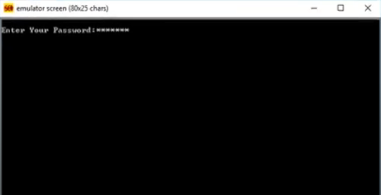
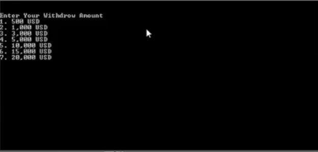

# Assembly-ATM-Service

## A simple ATM project that was created for my university class "Computer Architecture".

**Features**

- Password Confirmation
- Menu of options
- Balance display
- Withdraw
- Transfer
- Back and Exit

## Password Confirmation

## Options

## Withdraw

## New Balance Display

## Transfer

